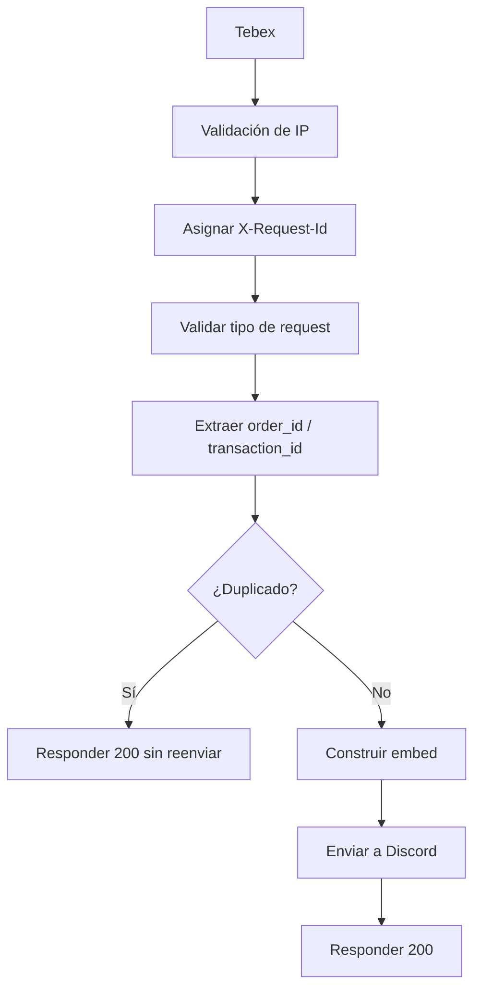

# WH-Tebex-MicroService

Microservicio Node.js que recibe webhooks de Tebex, valida el origen, deduplica eventos repetidos y publica compras en un canal de Discord con embeds legibles para administradores y usuarios.

## Vista rápida

| Componente | Función |
|---|---|
| Tebex webhook | Envía eventos de validación y compra |
| Express | Expone el endpoint HTTP |
| Discord bot | Publica embeds en el canal configurado |
| Idempotencia | Evita publicaciones duplicadas |
| Observabilidad | Expone `X-Request-Id`, `GET /healthz` y `GET /metrics` |

## Flujo de la integración



## Qué resuelve

- Publica la compra en Discord con formato visual claro.
- Filtra solicitudes no autorizadas por IP.
- Deduplica reintentos de Tebex para no duplicar anuncios.
- Expone métricas básicas para monitoreo.
- Genera un `requestId` por request para depuración.

## Requisitos

- Node.js 18 o superior.
- Un bot de Discord con permisos para leer y enviar mensajes.
- Un canal de Discord destino.
- Un endpoint de Tebex configurado hacia este servicio.

## Instalación

1. Crea `config.json` copiando `config.example.json`.
2. Completa el token, canal, puerto e información del embed.
3. Instala dependencias:

```bash
npm install
```

4. Inicia el servicio:

```bash
node index.js
```

## Configuración

### Configuración principal

| Clave | Propósito |
|---|---|
| `showServer` | Muestra u oculta servidores asociados a cada producto |
| `debug` | Activa logs más verbosos y desactiva la deduplicación |
| `defPort` | Puerto HTTP del servicio |
| `token` | Token del bot de Discord |
| `shopchannelID` | Canal donde se publican los embeds |
| `language` | Idioma de los textos de la app |

### Configuración del embed

| Clave | Propósito |
|---|---|
| `embed.url` | URL principal del embed |
| `embed.url_infooter` | Añade el dominio al footer |
| `embed.gifurl` | Imagen/thumbnail superior |
| `embed.imageurl` | Imagen principal del embed |
| `embed.emojititle` | Emoji del título |
| `embed.emojireact` | Reacción automática al mensaje |
| `embed.emojicurrency` | Emoji de moneda |
| `embed.color` | Color del embed |
| `embed.emojiproductArrow` | Prefijo visual para cada producto |
| `embed.useMCskin` | Cambia el thumbnail al avatar estilo Minecraft |

### Configuración API opcional

| Clave | Propósito |
|---|---|
| `api.favicon_url` | Redirige `/favicon.ico` a una URL externa |

## Ejemplo de `config.json`

```json
{
  "showServer": false,
  "debug": false,
  "defPort": 25500,
  "token": "DISCORD_BOT_TOKEN",
  "shopchannelID": "123456789012345678",
  "language": "es",
  "embed": {
    "url": "https://tienda.ejemplo.com",
    "url_infooter": true,
    "gifurl": "https://cdn.ejemplo.com/banner.png",
    "imageurl": "https://cdn.ejemplo.com/embed.png",
    "emojititle": "<:Tienda:000000000000000000>",
    "emojireact": "<:CHECK:000000000000000000>",
    "emojicurrency": "<:coin:000000000000000000>",
    "color": "#0099ff",
    "emojiproductArrow": "<:linea:000000000000000000> ",
    "useMCskin": true
  },
  "api": {
    "favicon_url": "https://example.com/favicon.png"
  }
}
```

## Configuración de Tebex

1. Crea el endpoint webhook en Tebex apuntando a tu servidor.
2. Permite únicamente las IPs oficiales de Tebex:
   - `18.209.80.3`
   - `54.87.231.232`
3. Verifica que Tebex pueda alcanzar el endpoint.
4. Revisa que el servicio responda correctamente a los eventos de validación.

## Endpoints

### `GET /healthz`

Devuelve el estado básico del proceso:

```json
{
  "ok": true,
  "language": "es",
  "uptime_seconds": 120,
  "request_count": 18
}
```

### `GET /metrics`

Devuelve contadores internos del servicio:

- requests totales
- validaciones webhook
- solicitudes aceptadas
- solicitudes rechazadas
- duplicados descartados
- errores
- payloads vacíos

### `POST /`

Recibe el webhook de Tebex y procesa:

- validación de webhook
- compra válida
- rechazo por IP
- deduplicación por `transaction_id` / `order_id`

## Idempotencia

El servicio guarda los eventos ya procesados en `.data/tebex-idempotency.json`.

- Si Tebex reintenta el mismo evento, el servicio responde `200` y no duplica el mensaje.
- En modo `debug`, esta verificación se omite para facilitar pruebas manuales.
- Si quieres reiniciar la deduplicación local, puedes borrar `.data/`.

## Logs y depuración

Cada request recibe un `X-Request-Id` y ese ID se replica en logs y respuestas.

En modo `debug`:

- se registran más detalles de requests
- se omite la deduplicación
- se facilita validar el flujo end-to-end

## Embed visual

El embed actual prioriza lectura rápida para administración y usuarios:

```text
<emoji título> Compra confirmada
────────────────────────────
Cliente: usuario
Total: $10.00 USD
Productos:
➜ Producto A x1 | $5.00
➜ Producto B x2 | $5.00
Footer: tienda.ejemplo.com
```

## Estructura del proyecto

| Ruta | Propósito |
|---|---|
| `index.js` | Arranque principal de Discord + Express |
| `handlers/` | Middlewares de request |
| `functions/` | Lógica de envío y traducción |
| `lib/` | Validación, logger, métricas e idempotencia |
| `langs/` | Archivos de idioma |

## Solución de problemas

- `Not authorized` o `403`: la IP no está en la allowlist de Tebex.
- `Webhook sin productos`: Tebex envió un payload vacío o incompleto.
- No llega a Discord: revisa `shopchannelID`, token y permisos del bot.
- Mensajes duplicados: el evento ya fue procesado y quedó en el store de idempotencia.

## Notas

- Este proyecto ya expone `GET /healthz` y `GET /metrics`.
- Las dependencias directas se limpiaron para evitar paquetes nativos innecesarios.
- El texto del embed puede ajustarse sin tocar la lógica del webhook.
