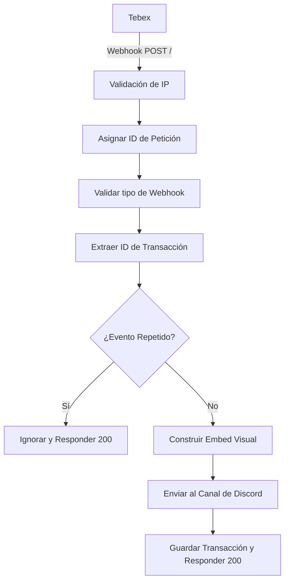

# 🛒 WH-Tebex-MicroService

Microservicio Node.js robusto, seguro y fácil de usar para recibir webhooks de **Tebex**, validar su origen, evitar notificaciones duplicadas y publicar las compras de forma instantánea en **Discord** con embeds altamente personalizables y profesionales.

---

## ✨ Características Principales

- **Fácil de Configurar**: Asistente interactivo en consola para Linux y Windows (Click to Run).
- **Integración con Discord**: Notificaciones automáticas de compras con soporte para skins de Minecraft.
- **Comandos Integrados**: Consulta de perfiles de Tebex y detalles de pagos directamente desde Discord (`!tbxuser`, `!tbxcheck`).
- **Seguridad y Validación**: Filtro estricto por IPs oficiales de Tebex para evitar falsificaciones.
- **Idempotencia**: Sistema anti-spam que evita notificaciones repetidas si Tebex reenvía un evento.
- **Monitorización**: Endpoints de `/healthz` y `/metrics` integrados.

---

## 🚀 Instalación y Uso (Click to Run)

Hemos simplificado la instalación para que no tengas que editar archivos de configuración manualmente.

### Requisitos previos
- Node.js 18 o superior.
- Un Bot de Discord y su token.
- Un servidor de Linux o Windows.

### 🐧 En Linux / Consolas (Bash)

1. Dale permisos de ejecución a los scripts:
   ```bash
   chmod +x setup.sh start.sh
   ```
2. Ejecuta el **Asistente de Configuración** interactivo:
   ```bash
   ./setup.sh
   ```
   *El asistente te guiará para introducir tu Token, ID del Canal, Puerto, Clave de Tebex, etc.*
3. Inicia el servidor:
   ```bash
   ./start.sh
   ```

### 🪟 En Windows

1. Haz doble clic en el archivo **`setup.bat`**. 
   *Se instalarán las dependencias necesarias y se abrirá el Asistente de Configuración.*
2. Responde a las preguntas del asistente en la consola.
3. Haz doble clic en el archivo **`start.bat`** para iniciar el microservicio.

*(Nota: Si lo prefieres, siempre puedes configurar usando el método tradicional de Node: `npm install`, luego `npm run setup` y finalmente `npm start`)*.

---

## 🎮 Comandos de Discord (Tebex Check)

| Comando | Uso | Descripción |
|---|---|---|
| `!tbxuser <nick\|uuid>` | `!tbxuser Notch` | Consulta un usuario Tebex. Muestra su perfil y un selector paginado con sus compras. |
| `!tbxcheck <tbx-id>` | `!tbxcheck 1234567890` | Consulta los detalles completos y exactos de un pago específico. |

---

## ⚙️ Configuración (`config.json`)

Si decides editar la configuración manualmente, estos son los valores disponibles:

### Principal y Tebex Check
| Clave | Propósito |
|---|---|
| `showServer` | `true/false` Muestra u oculta servidores asociados a cada producto. |
| `debug` | `true/false` Activa logs detallados y desactiva la deduplicación (para pruebas). |
| `defPort` | Puerto HTTP del servicio (Por defecto: 25577). |
| `token` | Token del bot de Discord. |
| `shopchannelID` | ID del Canal donde se enviarán las notificaciones de compras. |
| `tebexCheck.prefix` | Prefijo para los comandos (Ej: `!`). |
| `tebexCheck.apiKey` | **Tebex Private Key** para consultar datos. |
| `tebexCheck.requiredRole`| ID del Rol de Discord requerido para usar los comandos (Déjalo vacío para acceso público). |

### Embed de Compras
| Clave | Propósito |
|---|---|
| `embed.url` | URL al hacer clic en el título (Tu Tienda Tebex). |
| `embed.gifurl` | Banner / GIF superior en la notificación. |
| `embed.imageurl` | Imagen grande bajo el texto en la notificación. |
| `embed.color` | Color lateral del Embed (Ej: `#0099ff`). |
| `embed.useMCskin` | `true/false` Usa la cabeza de Minecraft del comprador como miniatura. |
| `embed.emojititle` | Emoji para el título de la compra. |

---

## 🔗 Configuración en Tebex

1. Ve al panel de control de tu tienda **Tebex**.
2. Dirígete a **Integrations -> Webhooks** y añade un nuevo Webhook.
3. Apunta la URL hacia tu servidor IP/Dominio con el puerto configurado (ej: `http://mi-servidor.com:25577/`).
4. **IMPORTANTE**: El microservicio está protegido y solo acepta peticiones de las IPs oficiales de Tebex (`18.209.80.3` y `54.87.231.232`). Si usas un proxy inverso como Cloudflare, asegúrate de que esté configurado para pasar la IP real.

---

## 📊 Endpoints de Observabilidad

| Método | Endpoint | Descripción |
|---|---|---|
| `GET` | `/healthz` | Devuelve el estado, uptime y contadores básicos del proceso. |
| `GET` | `/metrics` | Devuelve estadísticas detalladas (webhooks procesados, ignorados, deduplicados y errores). |
| `POST`| `/` | Endpoint principal que recibe los Webhooks de Tebex. |

---

## 🛠️ Solución de Problemas Comunes

- **`Not authorized` (403)**: La petición no viene de una IP oficial de Tebex. Verifica que no tengas un proxy/firewall alterando la IP de origen.
- **Webhook sin productos**: Tebex envió un evento de validación o un payload incompleto. Es normal en el primer intento de vinculación.
- **No llegan mensajes a Discord**: Verifica el `shopchannelID`, que el bot tenga el token correcto y posea permisos de "Ver Canal", "Enviar Mensajes" e "Insertar Enlaces" en ese canal.
- **No funcionan los comandos `!tbxuser`**: Revisa que has colocado correctamente la `tebexCheck.apiKey` (Tebex Private Key).

---

## 🔄 Flujo de la Integración


```mermaid
flowchart TD
    A[Tebex] -->|Webhook POST /| B[Validación de IP]
    B --> C[Asignar ID de Petición]
    C --> D[Validar tipo de Webhook]
    D --> E[Extraer ID de Transacción]
    E --> F{¿Evento Repetido?}
    F -- Sí --> G[Ignorar y Responder 200]
    F -- No --> H[Construir Embed Visual]
    H --> I[Enviar al Canal de Discord]
    I --> J[Guardar Transacción y Responder 200]
```
